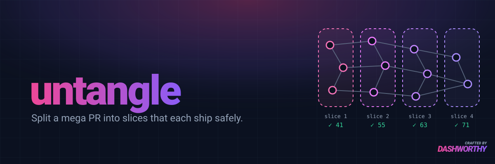

# untangle



A Claude Code plugin that splits an oversized, spec-driven PR into a stack of smaller
PRs, each of which ships without breaking existing functionality.

The `untangle` skill works in this order:

1. Pins the branch and its real base branch.
2. Maps what depends on what across the diff.
3. Proposes cut lines as a multi-select question. You accept or reject each one.
4. Settles the order.
5. Writes `split-plan.md` and `split-map.tsv`, and checks that every changed file is
   mapped to a slice.
6. Offers to build the stacked branches.

## Install

```
/plugin marketplace add dashworthy/untangle
/plugin install untangle@untangle
```

## Layout

```
.claude-plugin/                    plugin.json + marketplace.json
skills/untangle/SKILL.md          workflow
skills/untangle/references/       boundary traps, plan template, build steps
skills/untangle/scripts/          check_coverage.py (every changed file mapped?)
hooks/                            SessionStart hook routing "split this PR" requests to untangle
evals/<case>/                     claude plugin eval cases (case.yaml, prompt.md, graders/)
evals/<case>/build-fixture.sh     builds the synthetic repo for that case
evals/evals.json                  the same cases for the skill-creator loop
evals/grade_programmatic.py       mechanical grading for skill-creator runs
```

## Eval cases

All fixtures are made-up projects.

| Case | Fixture | What it tests |
|---|---|---|
| `split-multi-currency` | TypeScript invoicing, base `develop` | Base isn't `main`; a converter in the library folder imports feature code; test tooling that only exists on the branch; nav link order |
| `split-team-workspaces` | Python plant tracker, base `main`, plus a stale release branch | An audit-events file that depends on the Workspace model; migration foreign-key order; nav links |
| `small-cohesive-change` | Go, about 120 lines | Should recommend *not* splitting |

## Running `claude plugin eval`

```bash
claude plugin eval . --scaffold --allow-tools Bash Write Edit --judge-model claude-sonnet-5
```

- `--scaffold` is needed so the fixture repos get built.
- The Bash grant is needed because the agent has to run git.
- Sonnet is used as the judge because the rubrics grade files and need more than haiku.
- The Bash sandbox refuses to run if `~/.docker` contains symlinks, which Docker Desktop
  creates. Run the suite on CI, or on a machine without Docker Desktop.
